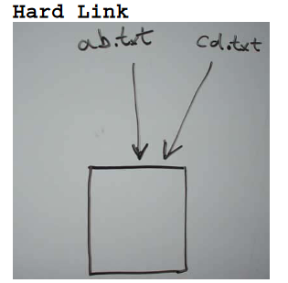
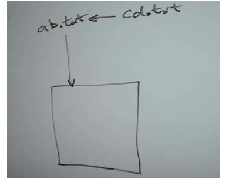
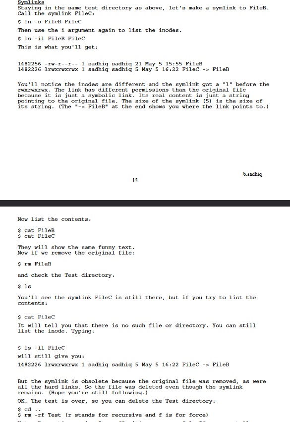

# Symlinks & Hardlinks

Files are organized within directories (or folders), and each file can be accessed through a hierarchical structure of directories originating from the root. However, there are instances where the same file can be accessed through multiple names, referred to as "links" in Unix and Linux systems.

## Hard Link

A Hard Link is where a file has two names which are both on an equal weighting, and both of the file names in the "inode table" point directly to the blocks on the disc that contain the data. See diagram below.

You set up a hard link with an ln command without options - if the file ab.txt already exists and you want to give an additional name (hard link) to it, you'll write ln ab.txt cd.txt and then both names will have equal ranking. The only way you'll know that there's a link there is by doing a long listing and you'll see a link count of 2 rather than 1, and if you need to find out what's linked to what, use the -i option to ls.

## Symbolic Link

A Symbolic Link is where a file has one main name, but there's an extra entry in the file name table that refers any accesses back to the main name. This is slighly slower at runtime that a hard link, but it's more flexible and much more often used in day to day admin work.

Symbolic links are set up using the `ln` command with the `-s` option - so for example:

`ln -s ab.txt cd.txt`

will set up a new name `cd.txt` that points to the (existing) file `ab.txt`. If you do a log listing (`ls -l`) of a directory that contains a symbolic link, you'll be told that it's a symbolic link with an "l" in the first column, and you'll be told where the file links to in the file name column. Very easy to spot!

## Soft Links(Symbolic Links)

1.Links have different inode numbers.
2. ls -l command shows all links with second column value 1 and the link
points to original file.
3. Link has the path for original file and not the contents.
4.Removing soft link doesn't affect anything but removing original file the
link becomes dangling link which points to nonexistant file.
In Softlink Inode is diff and the linked file will b a shortcut of first
file

## Hard Links

1. All Links have same inode number.
2.ls -l command shows all the links with the link column(Second) shows No.
of links.
3.Links have actual file contents
4.Removing any link just reduces the link count but doesn't affect other
links.

- In Hardlink, inode is the same and both are independent.
- Soft link can create directories but hard link can't.
- Hard links are created within the same file system, while soft links can cross file system boundaries.
- Hard links cannot cross partitions.
- A single inode number is used to represent a file in each file system. All hard links are based upon inode numbers.
- Linking across file systems will lead to confusing references for UNIX or Linux.

## Inode in Linux

In Linux, an inode is like a digital ID card for each file or directory. It holds all the important details about the file, such as who owns it, when it was last modified, and where it's stored on the disk.

## Inode Table

Think of the inode table as a big list that keeps track of all these ID cards. Each entry in the table represents a different file or directory on your computer.

- **What's Inside:** Each entry in the table contains crucial information about a file, like its size, permissions, and location on the disk.
- **Unique ID:** Every file and directory gets its own unique ID number within this table.
- **Fast Access:** This table helps the operating system quickly find and manage files, making tasks like opening files or checking permissions speedy.

## Why It Matters

Understanding inodes and the inode table helps you grasp how Linux manages files efficiently. They're like the behind-the-scenes organizers that keep your files in order and make your computer run smoothly.

## Understanding Soft Links and Hard Links

In Unix-like operating systems such as Linux, soft links and hard links are ways to create additional references to files. Here are practical examples using text files `ab.txt` and `cd.txt`:

## Example 1: Creating a Hard Link

## Steps to Create

1. **Create the File `ab.txt`:**

`echo "This is the content of ab.txt" > ab.txt`

2. **Create a Hard Link `cd.txt` pointing to `ab.txt`:**

`ln ab.txt cd.txt`

3. **Verify:**

`ls -i ab.txt cd.txt`

The `-i` option displays the inode number of each file. Both `ab.txt` and `cd.txt` will have the same inode number, indicating they are hard linked.

## Example 2: Creating a Soft Link

## Steps

1. **Create the File `cd.txt` (for demonstration purposes):**

  `echo "This is the content of cd.txt" > cd.txt`

2. **Create a Soft Link `ab_link.txt` pointing to `ab.txt`:**

`ln -s ab.txt ab_link.txt`

3. **Verify:**

`ls -l ab.txt ab_link.txt`

The `-l` option shows detailed information. `ab_link.txt` will be shown as a symbolic link, pointing to `ab.txt`.

## Differences Between Hard Links and Symbolic Links

Here are some differences between hard links and symbolic links:

1. **Inability to Create Hard Links for Directories:** Hard links cannot be created for directories.

2. **Behavior Upon Original File Deletion:**
   - If you remove the original file of a hard link, the link will still display the content of the file.

3. **Ability to Link to Directories:**
   - A symbolic link can be used to link to a directory.

4. **Effect of Original File Removal on Symbolic Links:**
   - A symbolic link, similar to a Windows shortcut, becomes useless when you remove the original file.

## EXAMPLE FOR HARD-LINk

## EXAMPLE FOR SOFT-LINk

