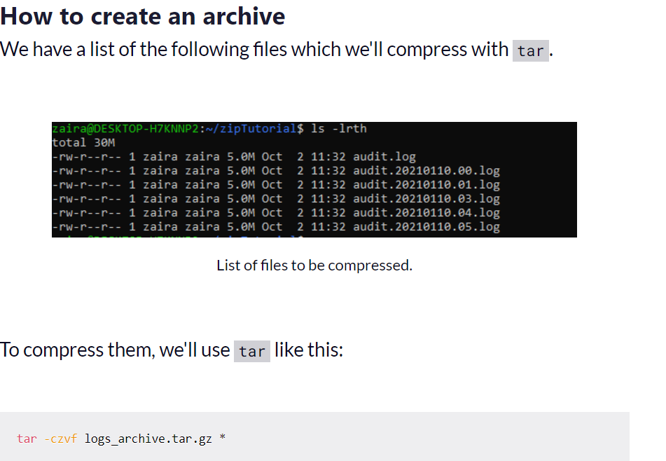
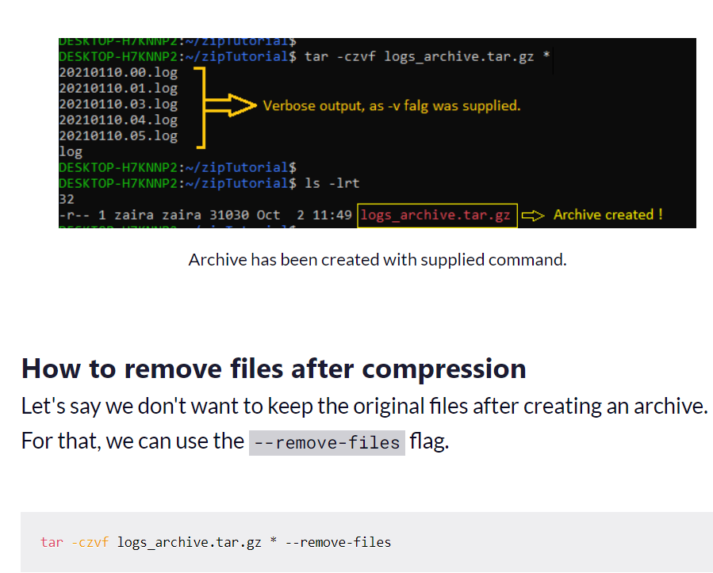
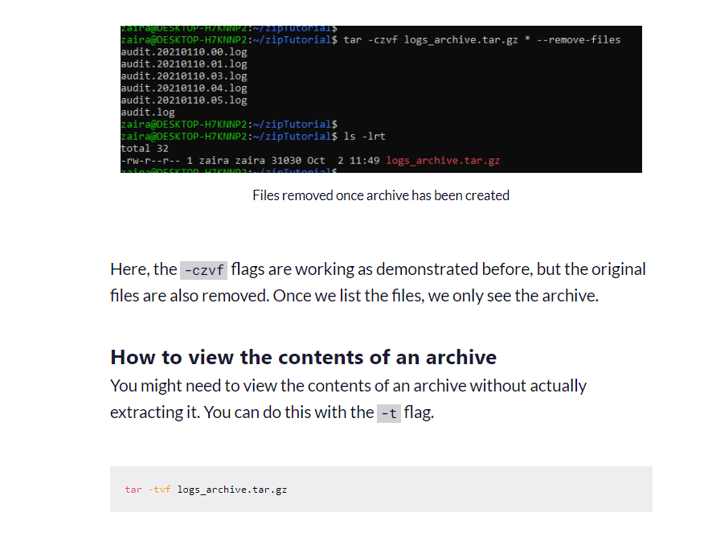
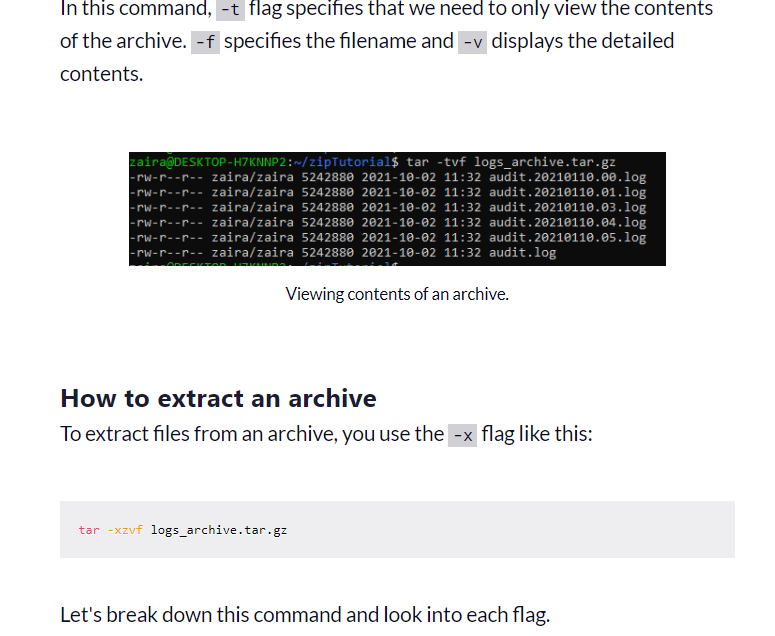
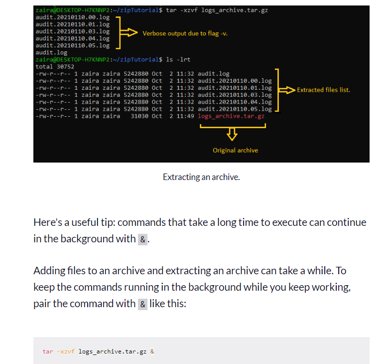
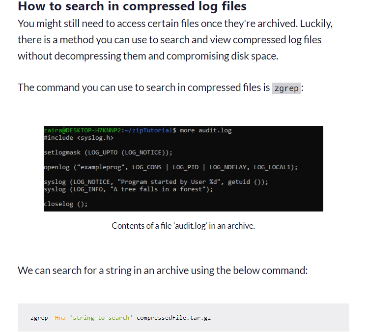
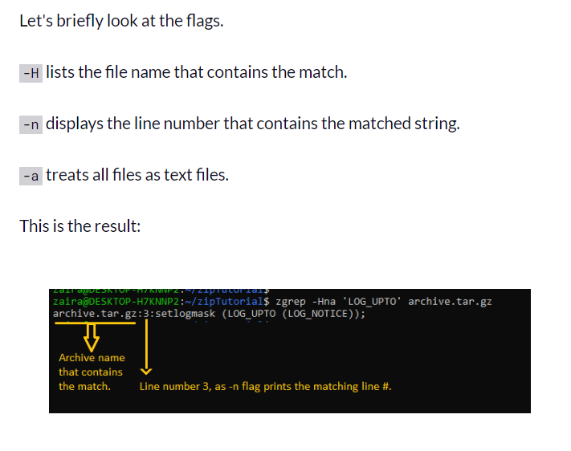

# File Compression

File compression is an essential utility across all platforms. It helps you reduce file size and share files efficiently. Compressed files are also easier to copy to remote servers.

You can also compress older and rarely used files and save them for future use, which helps conserve disk space.

In this post, we'll look at how to compress files with the `tar` command in Linux, along with some examples of `tar` in action.

## What is the `tar` command?

We use the `tar` command to compress and expand files from the command line. The syntax is shown below:

`tar [flags] destinationFileName sourceFileName`

The `tar` command uses the following flags to customize the command input:

| FLAG | EXPLANATION | USAGE |
|------|-------------|-------|
| `-c` | Create a new archive. | We use this flag whenever we need to create a new archive. |
| `-z` | Use gzip compression. | When we specify this flag, it means that the archive will be created using gzip compression. |
| `-v` | Provide verbose output. | Providing the `-v` flag shows details of the files compressed. |
| `-f` | Archive file name. | Archive file names are mapped using the `-f` flag. |
| `-x` | Extract from a compressed file. | We use this flag when files need to be extracted from an archive. |

Let's break down this command and look into each flag.

- `-c`: This flag stands for "create" and indicates that we are creating a new archive.
- `-z`: This flag specifies to use gzip compression while creating the archive.
- `-v`: The "verbose" flag provides detailed output, showing the files that are being archived.
- `-f`: This flag is used to specify the filename of the archive. In this command, it's creating an archive named 'logs_archive.tar.gz'.

In the results below, we can see that the archive has been created successfully.

- `-x`: This flag stands for "extract" and indicates that we are extracting files from an archive.
- `-z`: This flag specifies that the archive is compressed using gzip.
- `-v`: The "verbose" flag provides detailed output, showing the files that are being extracted.
- `-f`: This flag is used to specify the filename of the archive from which files will be extracted. In this command, it's extracting from the archive named 'logs_archive.tar.gz'.

